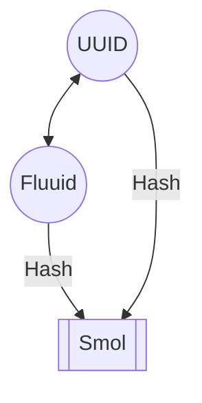

### Fluuid

Fluuid is a simple go package for generating fluent UUIDs.

Fluuids are UUIDs that are converted to a grammatically correct sentence. This makes them easy to remember and share, and adds spice to your life.
You can convert a fluuid to a UUID and vice versa.



### Examples

#### 128-bit UUIDs

> Corry Allie Evita the steerer of Bascom dreamed Lindsy Gunar Marlette and 2 short mice
> Mira Corey Cord the morrow of Cedars prays Magdalene Abie Freya and 32 bright alpacas
> Claire Gordon MacPherson the playmaker of Canova emptys Ilsa Alonzo Deery and 19 cute pheasants
> Candis Duky Harriman the corncrib of Blevins deserted Caye Gardie Osbert and 21 deep moles
> Doe Decca Giuliana the plea of Analomink dreams Lyndell Gregorio Mokas and 6 thirsty squirrels

#### 32-bit Smol IDs

> 39 expensive ewes stealthily drove
> 24 hungry coyotes fondly sang
> 65 small bees kookily sang
> 3 high rooks greatly sings
> 43 low jackals needily sang

### Features

- Built on UUID v4
- Optionally pass your UUID to generate a unique sentence
- 128 Bit Crypto Secure
- Grammatically correct sentences
- Easy to remember
- Has a Shakespeare feeling
- Universally Unique Identifier
- Generate Low Entropy 32 Bit Tokens

### Installation

```bash
go get github.com/nascarsayan/fluuid
```

### Usage

#### Create readable UUIDs

```go
package main

import (
  "fmt"

  guid "github.com/google/uuid"
  "github.com/nascarsayan/fluuid"
)

sentence := fluuid.New()
fmt.Println(uid) 
// Dari Findlay Joaquin the pathos of Bandytown 
// preserves Daisy Cletis Alarice and 29 salty hogs

// + Interconvert between UUIDv4 and fluuid.

uuid := guid.New()
fmt.Println(uuid)
// 92e39d12-d0a6-4953-8999-edbf85f7ad66
sentence = fluuid.FromUUID(uuid)
fmt.Println(sentence)
// Janot Boniface Harriet the contestant of Broseley 
// preserved Carrissa Gayler Hahnert and 31 windy gnus

hex, err := fluuid.ToUUID(sentence)
if err != nil {
  fmt.Errorf("error converting fluuid to uuid: %v", err)
}
fmt.Println(hex)
// 92e39d12-d0a6-4953-8999-edbf85f7ad66
```

#### Create smol IDs from UUIDs or fluuids

```go
package main

import (
  "fmt"

  "github.com/nascarsayan/fluuid"
)

long := fluuid.New()
fmt.Println(long)
// Allix Ernestus Matthieu the millwright of Cementon 
// dislikes Nerissa Fairfax Drucilla and 13 old aardvarks
short, err := fluuid.Smol(long)
if err != nil {
  fmt.Errorf("error converting uuid to smol: %v", err)
}
fmt.Println(short)
// 64 light doves lively ran
```

### SDKs in other Programming Languages

- JS/TS: https://github.com/Debdut/uuid-readable
